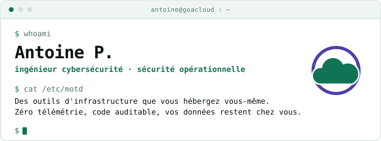

<!--
  Profil GitHub — AbrahamOP
  Règles de ce fichier, à ne pas défaire par distraction :

  1. Aucun widget tiers. Ce qui s'affiche est soit un fichier de ce dépôt
     (assets/*.svg, régénérés par `python3 tools/gen_svg.py`), soit une donnée
     GitHub officielle servie par img.shields.io sur mes propres dépôts. Pas de
     compteur de visites, pas de « now playing », pas de trophées : la marque
     promet zéro télémétrie, le profil tient la même ligne.

  2. Badges : uniquement des valeurs neutres linguistiquement. Vérifié le
     2026-08-21 — `commit-activity/m` rend « activité: 18/month » (anglais sur
     une page française, et « 0/month » au premier mois calme) et
     `languages/top` rend « langage: 62.1 % », le nom du langage disparaissant
     dès qu'on personnalise `label=`. Les deux sont écartés, ne pas les remettre.

  3. Les SVG ne déclarent aucune police de marque (JetBrains Mono, Fraunces,
     Inter) : affichés par GitHub dans une balise , donc en contexte isolé,
     ils ne pourraient pas la charger — une police déclarée jamais servie ne
     change rien au rendu et ment sur le fichier. Piles système uniquement.
     `python3 tools/check_contrast.py` garde les contrastes des deux palettes.

  4. Les blocs de code sont rendus à l'identique en thème clair et en thème
     sombre : c'est l'élément le plus robuste de la page, ne pas les remplacer
     par du HTML. Repli tout-ASCII si un caractère passe mal :
     ─ → -   │ ├ └ → | + \   ▼ → v   · → -   ≥ → >=   ─ (séparateur) → -
-->

<div align="center">

<picture>
  <source media="(prefers-color-scheme: dark)" srcset="assets/terminal-dark.svg">
  
</picture>

**Antoine P.** — ingénieur cybersécurité, sécurité opérationnelle<br>
détection et réponse · durcissement d'infrastructure · sécurité cloud

<sub>Une seule commande de cette page n'existe pas : <code>goafetch</code> est une mise en scène.<br>Les sorties, elles, décrivent une infrastructure qui tourne.</sub>

</div>

<br>

Je conçois et j'opère la détection : instrumenter les hôtes, écrire les règles, faire baisser le
bruit, puis instruire les alertes jusqu'au post-mortem. Côté **DevSecOps**, je durcis ce qui livre
le code autant que ce qui le fait tourner — chaîne d'intégration, dépendances, secrets, images,
réseau et identités. Et j'écris les outils qui manquent, sous
**[GoaCloud](https://goacloud.fr)** : de l'infrastructure et de la sécurité que l'on héberge chez
soi, en open source, sans télémétrie.

<br>

## `goafetch` — qui je suis

```
  _____     antoine@goacloud
 /     \    ──────────────────────────────────────────────────────────
| o   o |   Poste ...... ingénieur cybersécurité
|  \_/  |   Détecter ... Wazuh, règles maison, Suricata, MITRE ATT&CK
\_/\_/\_/   Répondre ... confiner, éradiquer, écrire le post-mortem
            Durcir ..... segmentation, moindre privilège, SSO OIDC, TLS
            Livrer ..... CI/CD, SAST et SCA, secrets, images durcies
            Cloud ...... GCP : IAM, journalisation, posture, Zero Trust
            Écrire ..... Go · Python · Bash · Swift
            Projet ..... GoaCore — console unifiée pour Proxmox
            Licence .... AGPL-3.0, auto-hébergeable, code auditable
            Terrain .... Proxmox segmenté en VLAN, OPNsense + Suricata
```

<br>

## `systemctl status goacore` — ce que je construis

```
● goacore.service - console unifiée pour une infrastructure Proxmox
     Loaded: loaded (GoaCloud/GoaCore; enabled; licence AGPL-3.0)
     Active: active (running) — en continu sur mon infrastructure
     Status: "aucun appel sortant, aucun plan de contrôle distant"
       Docs: https://goacloud.fr
     CGroup: /goacloud.slice/goacore.service
             ├─ inventaire et console des machines
             ├─ SIEM/SOAR Wazuh : tri, enrichissement, action proposée
             ├─ automatisation Ansible sur le parc
             └─ sauvegardes rejouées pour de vrai, reprise chronométrée
```

En service chez moi, en chantier pour vous : **[GoaCore](https://github.com/GoaCloud/GoaCore)**
administre au quotidien un homelab Proxmox segmenté, et son interface comme ses formats bougent
— c'est écrit avant, pas après. Sa partie la moins spectaculaire est celle à laquelle je tiens le
plus : une sauvegarde n'y est pas déclarée bonne parce qu'un fichier existe, elle est restaurée
dans un bac à sable jetable et coupé du réseau, et le temps de reprise est mesuré.

[](https://github.com/GoaCloud/GoaCore/releases)
[](https://github.com/GoaCloud/GoaCore/blob/main/LICENSE)
[](https://github.com/GoaCloud/GoaCore/blob/main/go.mod)

<br>

## `gh repo list --no-archived` — ce que je publie

| Dépôt | Le problème qu'il règle | État |
|:--|:--|:--|
| **[GoaCore](https://github.com/GoaCloud/GoaCore)** | Administrer un Proxmox, c'est huit onglets ouverts — hyperviseur, SIEM, sauvegardes, automatisation — et personne, le matin, pour dire si l'ensemble tient encore debout. | en service, en chantier |
| **[GoaBlockAD](https://github.com/AbrahamOP/GoaBlockAD)** | Un bloqueur de publicités voit exactement ce que vous voyez, et beaucoup en profitent. Celui-ci filtre en local, sans requête sortante. [Sur le Chrome Web Store](https://chromewebstore.google.com/detail/goablockad/iacipenfiandimlkkcmgafefcjcclhhl). | publié |
| **[claude-security-agents](https://github.com/AbrahamOP/claude-security-agents)** | Les méthodes de sécurité vivent dans des têtes et des documents, jamais dans l'outillage quotidien. 48 agents : blue, red, purple, DevSecOps, GRC, réponse à incident. | publié |
| **[redteam-toolkit](https://github.com/AbrahamOP/redteam-toolkit)** | Sur un test d'intrusion autorisé, une part absurde du temps passe à réécrire les commandes du test précédent. 90+ scripts, aide-mémoires et modèles de rapport. | publié |
| **[MenuMixer](https://github.com/AbrahamOP/MenuMixer)** | macOS règle le volume du système, jamais celui d'une application en particulier. Un mélangeur audio par application, en Swift, dans la barre de menus. | publié |

<sub><b>En service</b> : tourne en continu sur mon infrastructure. — <b>Publié</b> : installable aujourd'hui par quelqu'un d'autre que moi. — <b>En chantier</b> : l'usage tient, les formats et l'interface bougent encore.</sub>

Le seul filtre que j'applique : **publier ce qui s'installe ailleurs que chez moi**. Une partie de
ce qui tourne ici — sauvegarde vérifiée, gestion de fichiers, ordonnanceur de scripts, assistant
auto-hébergé — n'est pas encore installable par quelqu'un qui n'a ni mon réseau ni mon DNS, donc
n'est pas publiée. Et un dépôt que je ne maintiens plus est archivé, et il le dit : d'où le
`--no-archived`.

<br>

## `cat ~/.bash_logout` — ce que cette page n'a pas fait

```
# rien à nettoyer en sortant : cette page n'a rien enregistré.
# aucun compteur de visites, aucun traqueur, aucun profilage.
# c'est la règle des outils, elle vaut aussi pour le README.

$ exit
déconnexion — mais la session, elle, continue :
```

<div align="center">


**[goacloud.fr](https://goacloud.fr)** ·
[Les dépôts GoaCloud](https://github.com/GoaCloud) ·
[Discord](https://discord.gg/pSW7kxJSjf)

<sub>Un bug, une idée, une envie d'aider : une issue sur le dépôt concerné, ou le Discord.<br>
Une faille à signaler : les <i>Security Advisories</i> privés du dépôt, jamais une issue publique.</sub>

<br>

<sub><i>Aucun widget tiers sur cette page. Les visuels sont des fichiers de ce dépôt, régénérables
par <code>tools/gen_svg.py</code> ; les trois seules images distantes sont des badges qui lisent
l'API publique de GitHub sur mes propres dépôts. Il aurait été gênant de promettre le contraire.</i></sub>

</div>
